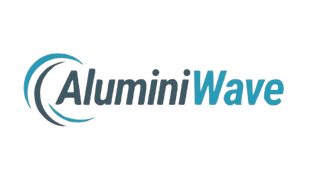

<h1 align="center">
  
  <br/>
  AluminiWave – AI-Powered Alumni Engagement and Management System
</h1>

<p align="center">
  <strong>Empowering universities to bridge the gap between students, alumni, and administrators through intelligent engagement.</strong>
</p>


---

## 📖 Overview

**AluminiWave** is a **web-based platform** designed to revolutionize how educational institutions manage and interact with their alumni networks.It provides a centralized system for **mentorship, event management, job sharing, AI-driven recommendations, and real-time communication** — empowering alumni, students, and administrators to collaborate effectively.

---

## 🎯 Major Goals and Objectives

- 🧩 **Scalable Platform** – Manage student and alumni profiles in a unified dashboard.  
- 💬 **Engagement Tools** – Facilitate mentorship, job sharing, and event participation.  
- 🤖 **AI Recommendations** – Suggest mentors, events, and jobs based on user data.  
- 🔐 **Secure Access** – Implement authentication and authorization using JWT + RLS.  
- 📊 **Admin Insights** – Provide analytics for user activity, events, and jobs.

---

## 🌐 System Architecture

**Frontend:** React + Vite + Tailwind CSS + ShadCN/UI  
**Backend:** Supabase (PostgreSQL, Auth, Realtime, Edge Functions)  
**Routing:** React Router DOM  
**Storage:** Supabase Storage  
**Auth:** Supabase Auth (JWT + Row-Level Security)  
**Realtime:** Supabase Realtime (WebSocket Chat)  
**AI Logic:** Supabase Edge Functions (Deno)

---

## 🧠 AI & Automation

The AI engine recommends:
- 🎓 **Mentors** – Based on student interests, skills, and course alignment.  
- 💼 **Jobs** – Matching keywords, skills, and academic background.  

Supabase **Edge Functions** handle the AI logic for fast, serverless computation.

---

## 🖥️ System Features

### 👨‍🎓 Student Portal
- Personalized **dashboard** with event, job, and mentor suggestions  
- **Event participation** and attendance tracking  
- **Mentorship requests** and active session view  
- **Real-time chat** with mentors and alumni  
- **Profile settings** with resume and social links  

### 👨‍💼 Alumni Portal
- **Event creation** and management with media upload  
- **Job posting** and removal options  
- **Mentorship panel** to approve or reject requests  
- **Networking tools** to connect with other alumni  

### 🛠️ Admin Interface
- Centralized **event/job moderation**  
- **Analytics dashboard** for engagement tracking  
- **User management** (approve, block, assign roles)

---

## ⚙️ Software Requirements

| Category | Tools / Frameworks |
|-----------|--------------------|
| **Frontend** | React, Vite, Tailwind CSS, ShadCN/UI |
| **Backend** | Supabase (Auth, Storage, Realtime, Edge Functions) |
| **Routing** | React Router DOM |
| **IDE** | Visual Studio Code |
| **Version Control** | Git & GitHub |
| **Package Manager** | npm |
| **CLI Tools** | Supabase CLI |


---

## 🧩 Database Design

Key Entities:
- **Users** – Roles: Student, Alumni, Admin  
- **Events** – Created by alumni/admin  
- **Jobs** – Posted by alumni  
- **Mentorships** – Links mentors with students  
- **Messages** – Real-time communication  
- **Sessions** – Scheduled mentorship events  

Protected via **Supabase RLS** for secure data access.

---

## 🚀 Deployment & Development

1. **Clone the repo**
   ```bash
   git clone https://github.com/yourusername/AluminiWave.git
   cd AluminiWave

2. **Install dependencies**
   ```bash
   npm install

3. **Setup Supabase**

- Create a new project at Supabase
- Configure .env file:

  ```env
  VITE_SUPABASE_URL=your_project_url
  VITE_SUPABASE_ANON_KEY=your_anon_key

4. Run locally
   ```bash
   npm run dev

---

## 🔮 Future Enhancements

- Mobile app using React Native or Flutter
- Advanced AI (NLP-based recommendations)
- Gamification system (badges, leaderboards)


